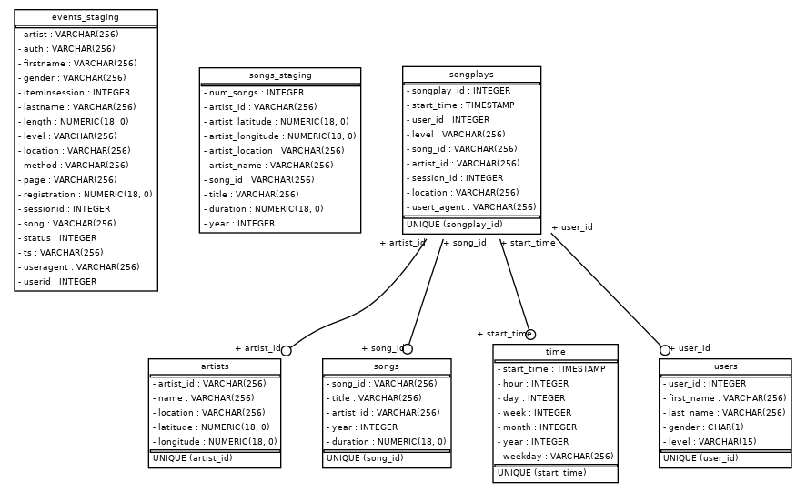

# Sparkify - Redshift DataWareHouse (3 Udacity project for Date Enginner nanodegree program)

## Introduction

Using the song and event datasets, I created a star schema optimized for queries on song play analysis. 

## Database purpose

This data modeling has as goal to organize and structure the songs that are lisetineng.

## Database schema design

### Fact Table
songplays - records in event data associated with song plays i.e. records with page NextSong
* songplay_id, start_time, user_id, level, song_id, artist_id, session_id, location, user_agent


### Dimension Tables
users - users in the app
* user_id, first_name, last_name, gender, level
songs - songs in music database
* song_id, title, artist_id, year, duration
artists - artists in music database
* artist_id, name, location, lattitude, longitude
time - timestamps of records in songplays broken down into specific units
* start_time, hour, day, week, month, year, weekday




## How to run this project 

### Create DB

Be sure you Redshift database is created. 
```
$ cp dwh.cfg.example dwh.cfg
```

Replace the DB parameters in dwh.cfg file

### Run scripts
```
pipenv shell
pip install -r requirements.txt
python create_tables.py 
python etl.py
```

## Generate ER Diagram
```
python generate_schema.py
```

## Queries

### I want to know the most relevant song
```
SELECT songs.title,  COUNT(songplays.song_id) as counted
from songplays
INNER JOIN songs ON songs.song_id = songplays.song_id
GROUP BY songs.title
ORDER BY counted DESC
LIMIT 1
```


### I want to know the most relevant artists
```
SELECT artists.name,  COUNT(songplays.artist_id) as counted_songs
from songplays
INNER JOIN artists ON artists.artist_id = songplays.artist_id
GROUP BY artists.name
ORDER BY counted_songs DESC
```

### I want to know where people play songs (User-agent)
```
SELECT songplays.usert_agent,  COUNT(songplays.usert_agent) as counted
from songplays
GROUP BY songplays.usert_agent
ORDER BY counted DESC
LIMIT 10
```